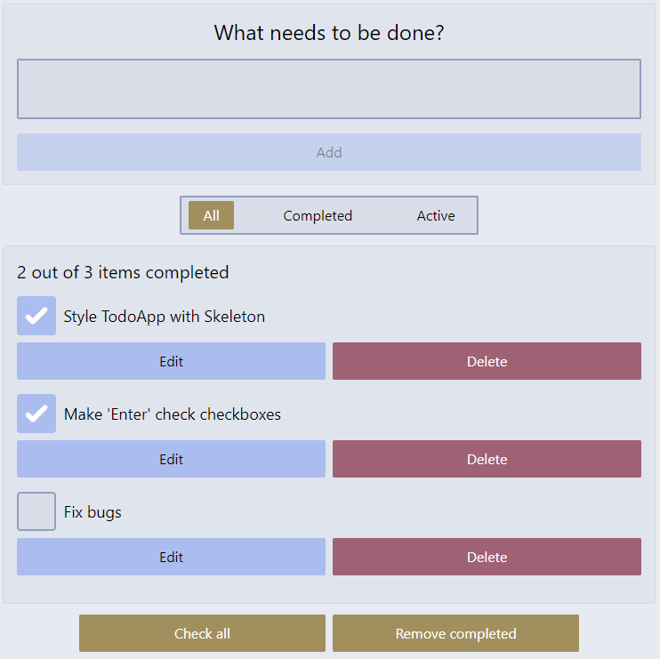

# TodoApp
Todo Application written in Svelte. [Click here to try it out](https://carlosgdcj.github.io/todo-app/).

This project is an extenstion of the [MDN Svelte tutorial](https://developer.mozilla.org/en-US/docs/Learn/Tools_and_testing/Client-side_JavaScript_frameworks/Svelte_getting_started).

## Functionalities

* Create, Delete and Edit Todos
* Todos persist through sessions (saved to localStorage)
* Fully functional using the keyboard only
* Support to Dark Mode

## Screenshots

## Tools used
* Deployed to GitHub Pages using GitHub Actions
* Written with Svelte + SvelteKit + TypeScript
* Styled with Skeleton + Tailwind